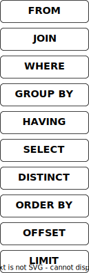

# Query Engine

<!--- https://www.cockroachlabs.com/docs/stable/architecture/sql-layer.html --->

> If you are interested in how databases work, I recommend the resources from [The CMU Database Group](https://db.cs.cmu.edu/), and the collection of resources at [Awesome Database Learning](https://github.com/pingcap/awesome-database-learning) and [Awesome Database Development](https://github.com/huachaohuang/awesome-dbdev).

The Opteryx query engine has the following key components and processing queries follows this high-level series of steps:

&emsp;**Parser & Lexer** receives the user SQL and builds an Abstract Syntax Tree (AST).  
&emsp;**Binder** maps contextual information to the AST.  
&emsp;**Planner** receives the AST and builds a Query Plan.  
&emsp;**Optimizer** receives a Query Plan and rewrites it to improve performance.   
&emsp;**Executor** receives the Query Plan and returns the result dataset.  

## Parser & Lexer

The primary goal of the Parser and Lexer (which in some engines is two separate components) is to interpret the SQL provided by the user. This is generally done in two steps, the first is the break the query into separate tokens (or words) and the second is to understand the meaning of those tokens.

For example for this statement

~~~sql
SELECT SELECT
  FROM FROM
~~~

The Parser and Lexer will understand that we're requesting the field `SELECT` from the relation `FROM`.

Opteryx uses [sqlparser-rs](https://github.com/sqlparser-rs/sqlparser-rs) as its Parser and Lexer, as a Rust library, Opteryx creates Python bindings for sqlparser-rs (derived from [sqloxide](https://github.com/wseaton/sqloxide)). Opteryx does not support all features and functionality provided by this library.

This sqlparser-rs interprets all SQL except for the Temporal `FOR` clause which are handled separately.

## Binder

The Binder's primary goal is to embelish and replace information in the AST with details which the Parser & Lexer did not have.

This is used for replacing variables in queries with their literal equivalents and adding temporal information to relations.

## Query Planner

The Query Planner's primary goal is to convert the AST into a plan to respond to the query. The Query Plan is described in a Directed Acyclic Graph (DAG) with the nodes that acquire the raw data, usually from storage, at the start of the flow and the node that forms the data to return to the user (usually the `SELECT` step) at the end.

The DAG is made of different nodes which process the data as they pass through then node. Different node types exist for processing actions like Aggregations (`GROUP BY`), Selection (`WHERE`) and Distinct (`DISTINCT`).

Query plans follow a generally accepted order of execution. This does not match the order queries are usually written in, instead it follows this order:

 

The planner ensures the processes to be applied to the data reflect this order and creates the most convenient plan to achieve this.

The Query Plan can be seen for a given query using the `EXPLAIN` query.

## Query Optimizer

The goal of the Query Optimizer is to rewrite the Query Plan to a plan which will return result to users faster. This is generally achieved through reducing the data being handled as early in the query as possible (such as projection push-down), reducing the complexity of steps (such as using logical equivelences to make expressions simpler) or combining steps (such as sort and limit into a heap sort).

The current optimizer in Opteryx is immature with very few rules and requires hand-tuning of the input query for the optimizer to achieve best results.

## Query Executor

The goal of the Query Executor is to produce the results for the user. It takes the Plan and executes the steps in the plan.

Opteryx implements a vectorized Volcano model executor. This means that the planner starts at the node closest to the end of the plan (e.g. `LIMIT`) and asks it for a chunk of data. This node asks its preceeding node for a chunk of data, etc etc until it gets to the node which aquires data from source. The data is then processed by each node until it is returned to the `LIMIT` node at the end.

## Performance Features

The following features are build into the query engine to improve performance

- Small chunks are merged together (referred to as 'defragmentation') before activities which operate on the entire chunk-at-a-time (such as selections)
- Projections are pushed to the blob parser, either to prevent parsing of unwanted fields (Parquet), or before passing to the next operation
- A buffer pool is used to maintain an in-memory cache of blobs
- A shared blob cache can be used (e.g. memcached) to reduce reads to attached or remote storage
- An [LRU-K](https://en.wikipedia.org/wiki/Page_replacement_algorithm#Variants_on_LRU) cache eviction strategy with a fixed eviction budget per query to help ensure effective use of the blob cache
- Aggressive pruning of date partitioned datasets
- SIMD and vectorized execution where available (via [Numpy](https://numpy.org/devdocs/reference/simd/index.html) and [PyArrow](https://arrow.apache.org/docs/format/Columnar.html))
- Projection before `GROUP BY` to reduce data handled by the aggregators
- `null` values are eliminated from filters before they are executed, and added back in after values have been compared, reducing the pointless work of comparing `null` values