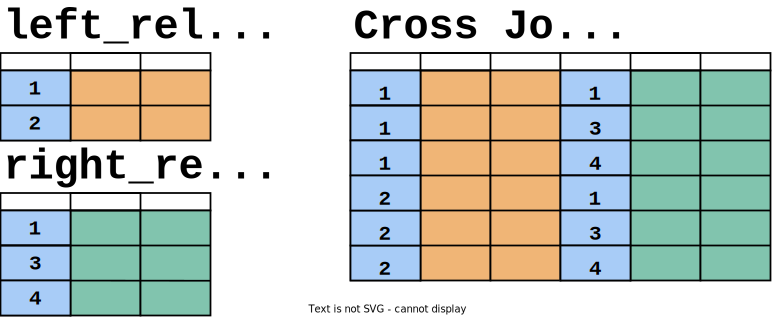
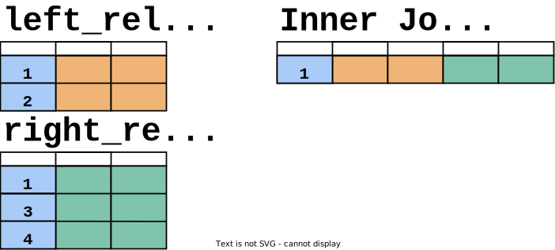
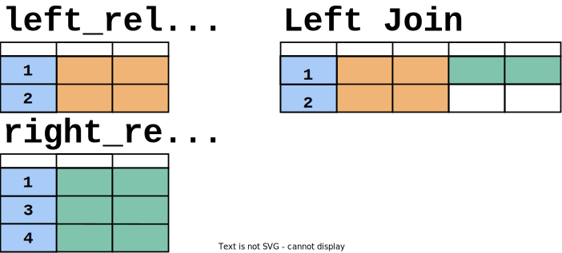
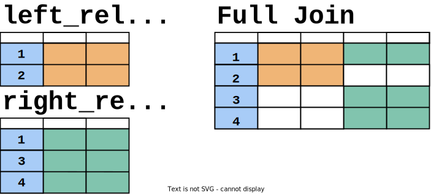
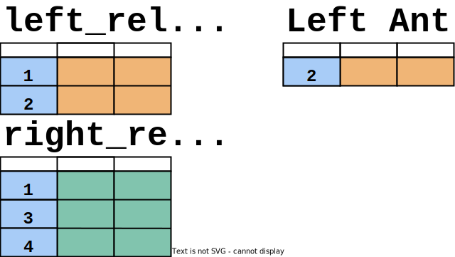

# Joins

Joins allow you to combine data from multiple relations into a single relation. There are a number of different join types available, each combines relations in different ways.

## CROSS JOIN

~~~
FROM left_relation CROSS JOIN right_relation
~~~
~~~
FROM left_relation, right_relation
~~~

A `CROSS JOIN` returns the Cartesian product (all combinations) of two relations. 

**Syntax**

Cross joins can either be specified using the explicit `CROSS JOIN` syntax or by specifying multiple relations in the `FROM` clause.

~~~sql
SELECT *
  FROM left_relation
 CROSS JOIN right_relation;
~~~

The size of the resultant dataset when using `CROSS JOIN` is length of the two datasets multiplied together (2 x 3 = 6, in the pictorial example), which can easily result in extremely large datasets. When an alternate join approach is possible, it will almost always perform better than a `CROSS JOIN`.

`CROSS JOIN UNNEST` is a specific variation of a `CROSS JOIN`, where the values in an ARRAY column are treated like a single column relation.

## INNER JOIN

~~~
FROM left_relation [ INNER ] JOIN right_relation < ON condition | USING (column) >
~~~

An `INNER JOIN` returns rows from both relations where the value in the joining column of one relation matches the value in the joining column of the other relation. It's often the most commonly used join due to its straightforward and predictable behavior.

**Syntax**

You can specify the `INNER JOIN` using the full `INNER JOIN` syntax or the shorter `JOIN` syntax. You can define the joining logic using either the `ON` condition or `USING(column)` syntax.

~~~sql
SELECT *
  FROM left_relation
 INNER JOIN right_relation
    ON left_relation.column_name = right_relation.column_name;
~~~

In this example, the blue column is used as the joining column in both relations. Only the value `1` occurs in both relations so the resultant dataset is the combination of the row with `1` in _right_relation_ and the row with `1` in _left_relation_.

`INNER JOIN ... ON` maintains all of the columns in relations on both sides of the `JOIN`.

`INNER JOIN ... USING` keeps a single instance of the columns in the `USING` clause, these columns are not considered a member of either of the left or right relations.

## NATURAL JOIN

~~~
FROM left_relation NATURAL JOIN right_relation
~~~

A `NATURAL JOIN` performs a similar join to an `INNER JOIN ... ON` where the join conditions are automatically determined as equals conditions between columns with the same names in the two relations. This is not recommended in queries supporting production systems as these queries are brittle, especially in situations where schemas may change.

Performing a self `NATURAL JOIN` (the same relation for the left and right relations) removes rows which contain `NULL` values.

## LEFT JOIN

~~~
FROM left_relation LEFT [ OUTER ] JOIN right_relation ON condition
~~~

A `LEFT JOIN` returns all rows from the left relation, and rows from the right relation where there is a matching row, otherwise the fields for the right relation are populated with `NULL`.

**Syntax**

~~~sql
SELECT *
  FROM left_relation
  LEFT OUTER JOIN right_relation
    ON left_relation.column_name = right_relation.column_name;
~~~

## RIGHT JOIN

A `RIGHT JOIN` is the same as a `LEFT JOIN` with the relations swapped.

## FULL JOIN

~~~
FROM left_relation FULL [ OUTER ] JOIN right_relation ON condition
~~~

The `FULL JOIN` keyword returns all rows from the left relation, and all rows from the right relation. Where they have a matching value in the joining column, the rows will be aligned, otherwise the fields will be populated with `NULL`.

**Syntax**

~~~sql
SELECT *
  FROM left_relation
  FULL OUTER JOIN right_relation
    ON left_relation.column_name = right_relation.column_name;
~~~

## LEFT SEMI JOIN

~~~
FROM left_relation LEFT SEMI JOIN right_relation ON condition
~~~

The `LEFT SEMI JOIN` keyword performs an `INNER JOIN` between the left and right relations but only return columns from the left_relation.

**Syntax**

~~~sql
SELECT *
  FROM left_relation
  LEFT SEMI JOIN right_relation
    ON left_relation.column_name = right_relation.column_name;
~~~

## RIGHT SEMI JOIN

A `RIGHT SEMI JOIN` is the same as a `LEFT SEMI JOIN` with the relations swapped.

## LEFT ANTI JOIN

~~~
FROM left_relation LEFT ANTI JOIN right_relation ON condition
~~~

The `LEFT ANTI JOIN` keyword performs an `INNER JOIN` between the left and right relations, however, instead of returning matching rows, only rows from the left_relation where there is no match are returned, and no columns or rows from the right_relation are returned.

**Syntax**

~~~sql
SELECT *
  FROM left_relation
  LEFT ANTI JOIN right_relation
    ON left_relation.column_name = right_relation.column_name;
~~~

## RIGHT ANTI JOIN

A `RIGHT ANTI JOIN` is the same as a `LEFT ANTI JOIN` with the relations swapped.