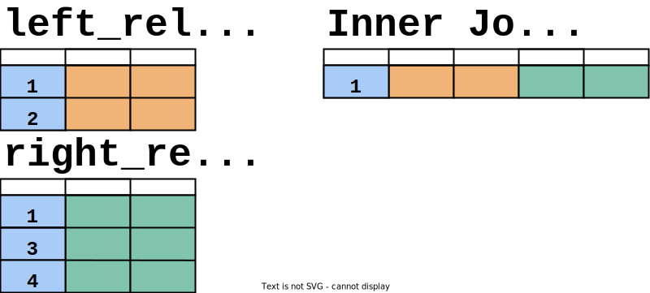
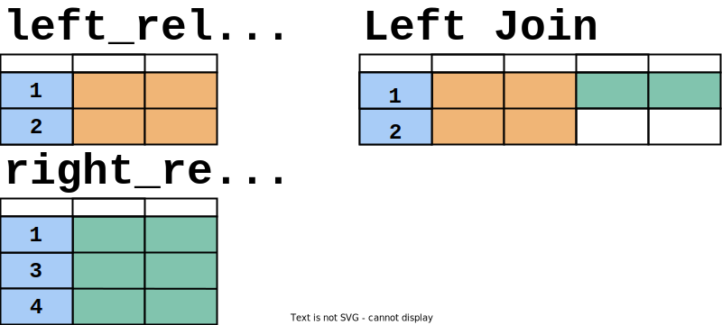

# Joins

Joins allow you to combine data from multiple relations (tables or datasets) into a single result set. Different join types provide different ways to combine data, each suited to specific use cases.

## CROSS JOIN

~~~
FROM left_relation CROSS JOIN right_relation
~~~
~~~
FROM left_relation, right_relation
~~~

A `CROSS JOIN` returns the Cartesian product (all possible combinations) of two relations. Each row from the left relation is paired with every row from the right relation.

**Syntax**

Cross joins can be specified using either the explicit `CROSS JOIN` syntax or by listing multiple relations in the `FROM` clause separated by commas.

~~~sql
SELECT *
  FROM left_relation
 CROSS JOIN right_relation;
~~~

The size of the result set from a `CROSS JOIN` is the product of the row counts of the two input datasets (2 × 3 = 6 in the pictorial example). This can easily result in extremely large datasets. When an alternative join approach is available, it will almost always perform better than a `CROSS JOIN`.

**Special case:** `CROSS JOIN UNNEST` is a specific variation where values in an ARRAY column are treated as if they were rows in a single-column relation.

## INNER JOIN

~~~
FROM left_relation [ INNER ] JOIN right_relation < ON condition | USING (column) >
~~~

An `INNER JOIN` returns only the rows from both relations where the values in the joining columns match. It's the most commonly used join type due to its straightforward and predictable behavior.

**Syntax**

You can specify an `INNER JOIN` using the full `INNER JOIN` keyword or the shorter `JOIN` keyword. You can define the joining condition using either the `ON` clause or the `USING(column)` syntax.

~~~sql
SELECT *
  FROM left_relation
 INNER JOIN right_relation
    ON left_relation.column_name = right_relation.column_name;
~~~

In this example, the blue column is used as the joining column in both relations. Only the value `1` appears in both relations, so the result set contains the combination of rows with `1` from both _left_relation_ and _right_relation_.

**Note on column handling:**

- `INNER JOIN ... ON` retains all columns from both relations in the result.
- `INNER JOIN ... USING` keeps only a single instance of the columns specified in the `USING` clause. These shared columns are not considered members of either the left or right relation.

## NATURAL JOIN

~~~
FROM left_relation NATURAL JOIN right_relation
~~~

A `NATURAL JOIN` performs a join similar to an `INNER JOIN` where the join conditions are automatically determined. It creates equality conditions between all columns with matching names in both relations. This approach is generally not recommended for production systems, as queries using `NATURAL JOIN` are fragile and can break when schemas change (e.g., when new columns with matching names are added).

**Special behavior:** Performing a self `NATURAL JOIN` (using the same relation for both left and right sides) effectively filters out rows containing `null` values in any column.

## LEFT JOIN

~~~
FROM left_relation LEFT [ OUTER ] JOIN right_relation ON condition
~~~

A `LEFT JOIN` returns all rows from the left relation. For rows with matching values in the right relation, the corresponding right relation columns are included. For rows without a match, the right relation columns are filled with `null` values.

**Syntax**

~~~sql
SELECT *
  FROM left_relation
  LEFT OUTER JOIN right_relation
    ON left_relation.column_name = right_relation.column_name;
~~~

## RIGHT JOIN

A `RIGHT JOIN` is functionally equivalent to a `LEFT JOIN` with the left and right relations swapped. It returns all rows from the right relation, with matching left relation data where available, and `null` values for non-matching rows.

## FULL JOIN

~~~
FROM left_relation FULL [ OUTER ] JOIN right_relation ON condition
~~~

The `FULL JOIN` (also called `FULL OUTER JOIN`) returns all rows from both the left and right relations. Where rows have matching values in the joining column, they are aligned in the result. For non-matching rows from either side, the columns from the other relation are filled with `null` values.

**Syntax**

~~~sql
SELECT *
  FROM left_relation
  FULL OUTER JOIN right_relation
    ON left_relation.column_name = right_relation.column_name;
~~~

## LEFT SEMI JOIN

~~~
FROM left_relation LEFT SEMI JOIN right_relation ON condition
~~~

The `LEFT SEMI JOIN` performs an intersection between the left and right relations, but returns only columns from the left relation. This is useful when you want to filter the left relation to only include rows that have matching rows in the right relation, without actually including any columns from the right relation.

**Syntax**

~~~sql
SELECT *
  FROM left_relation
  LEFT SEMI JOIN right_relation
    ON left_relation.column_name = right_relation.column_name;
~~~

## RIGHT SEMI JOIN

A `RIGHT SEMI JOIN` is functionally equivalent to a `LEFT SEMI JOIN` with the left and right relations swapped.

## LEFT ANTI JOIN

~~~
FROM left_relation LEFT ANTI JOIN right_relation ON condition
~~~

The `LEFT ANTI JOIN` returns rows from the left relation that do **not** have matching rows in the right relation. Only columns from the left relation are included in the result; the right relation serves only to filter out matching rows.

**Syntax**

~~~sql
SELECT *
  FROM left_relation
  LEFT ANTI JOIN right_relation
    ON left_relation.column_name = right_relation.column_name;
~~~

## RIGHT ANTI JOIN

A `RIGHT ANTI JOIN` is functionally equivalent to a `LEFT ANTI JOIN` with the left and right relations swapped.